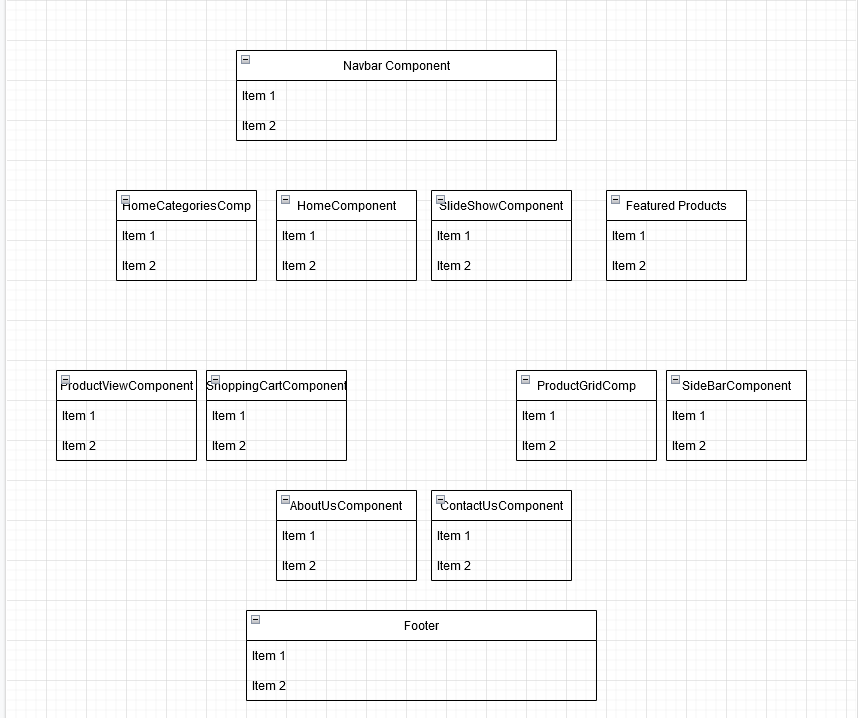
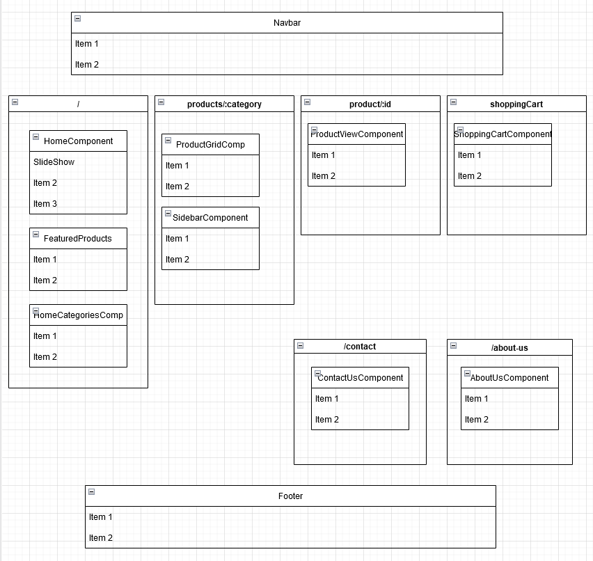
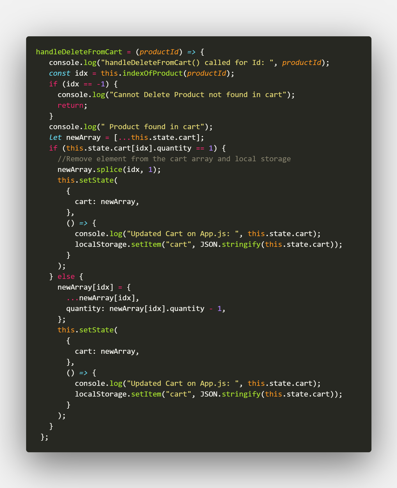
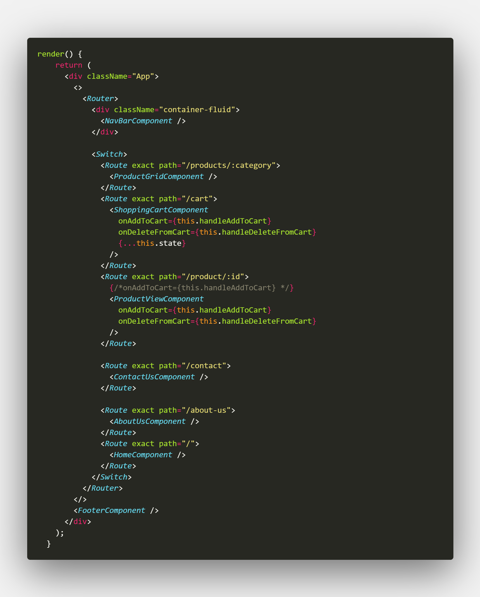
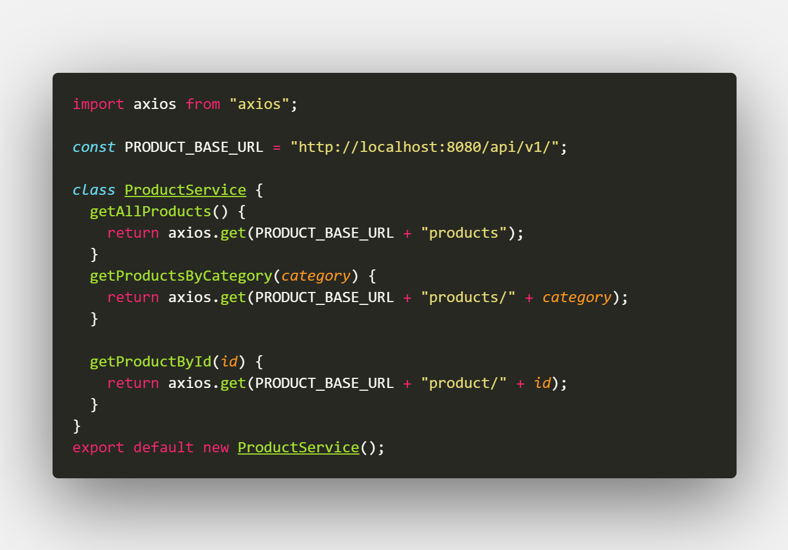

# E-Commerce Website Project Overview

This webapp was created using the ReactJS, Spring, with mySQL stack.

## Front End

The front end of the websites has several components as illustrated above. The components are organized by relationship. Components that have a relationship with one another are grouped relativel closer to one another.

The overall layout of the page is quite simple with each page resuing the navbar and footer components and varying in the components that are the focused of the page. The page have been grouped further in the image below.

## Shopping Cart Functionality

Having a shopping cart is an essential function of any modern online e-commerce store. In this case, the shopping cart function was made by implementing a parent-child relationship between with components that have the ability to add or/and remove items to and from the shopping cart. Moreover, the data is saved and retrieved fromt the browsers local storage for persistance.

The productview component displays the individual product along with its corresponding information such as the price. While the shopping cart component displays the array of products that are in the shopping cart.

The program starts by retreving data from the local storage and setting the internal state of the cart to it. Meanwhile the child components receive a reference to the handle add/delete from cart functions that are responsible for updatign the state and local storage. Whenever the add or delete button is clicked, the child component will call the passed reference function with the appropriate parameters. Lastly, the parent component will take cart of updating the state once again and the local storage as well.

A reasoning behind this design is the simplicity it offers. Originally the child components would read directly from the localStorage and update their state to then display the shopping cart. A problem in the shopping cart encountered with the old architecture is that whenever a function in the parent component sets the state and updates the cart, the DOM gets rendered once again. However, the child component is rendered before the localStorage is updated. Hence, the child component reads the unupdated version of the shopping cart. This translates into showing as if the count of the product is seemingly 1 behind, unless the page is reloaded.

The issue was fixed with the architecture shown above, where the child components receive the state from the parent. In this case, by design, there is no need to wait for the local storage to update which leads to better speed and less redundancy since it eliminates the need to reload to wait for the local storage to update. Moreover, the child components make use of the React Life Cycle hooks, " ComponentDidMount()/getDerivedStateFromProps()" to update the state based on the parent props.
An added feature behind this design model is that there is only one component interacting with the local storage. This has many benefits. The first is that it follows organized design principles. The parent function acts like an interface to the local storage which also improves access control and the chances of an offset function making an errounious change to the local storage.

**App.js**

**Shopping Cart/ ProductView Components**

## Routing

React Router

An unforeseen issue that I ecountered was naming. The way React Router works is it will render whichever ever path matches first. For instance,
if given path "/product" and "/products" it will inevitably go to "product" because it is the first match. This issue is shown in
[this repo of stack overlow](https://stackoverflow.com/questions/43351752/react-router-changes-url-but-not-view "this repo of stack overlow").
The fix for this is to use the 'exact' keyword. However, I dedcided It'd be more appropriate to rename the paths.

## Database Connectivity

The webapp is able to connect the local database using the axios Http Client and implementing the API in ProductService.js.

The API is very simple to use and implement. Components that need to display products from certain categories make use of the defined functions in the class.

For testing the HTTP requests, I used the highly recommended [Postman service](https://www.postman.com/). It is a useful tool that can send various HTTP request and display the output. The webapp is neatly designed and also has the desktop agent which may be necessary in some scenarios\*(Postman will indicate so).

## Backend
